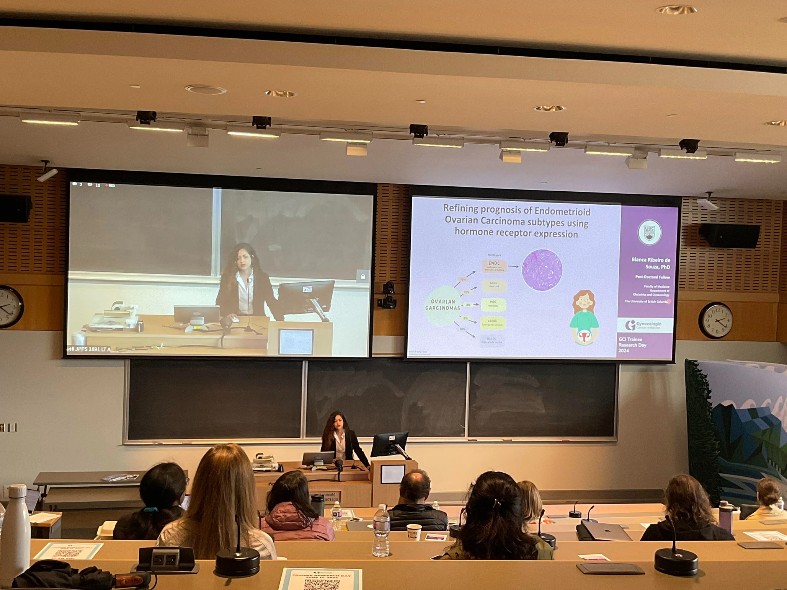
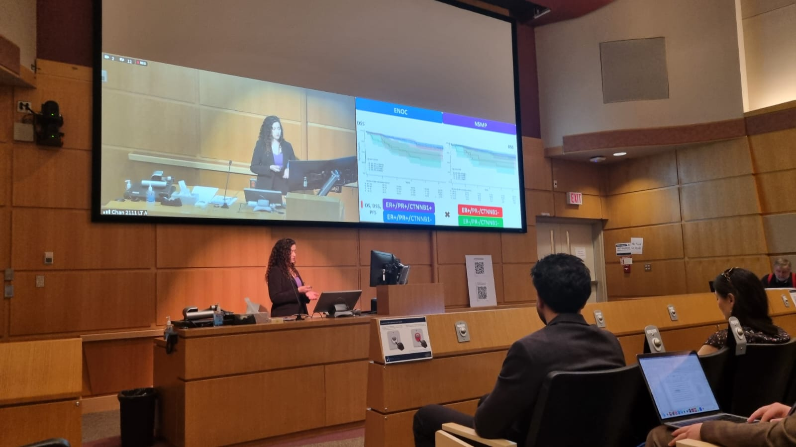

# More about my work on the least studied histotype of ovarian carcinoma

## Poster presented at the Canadian Conference on Ovarian Cancer Research (CCOCR) 2024

PDF version [here](files/poster-ccocr-2024.pdf).

## Invited talk at Gynecologic Cancer Initiative (GCI) trainee day

Recording available on <a href="https://youtu.be/cl7Lp7u4CJ8?t=1661" target="_blank">YouTube</a>.

Awarded [Best Diagnostic & Therapeutics Presentation](https://gynecancerinitiative.ca/gci-trainee-research-day-2024-recap/).

## Talk at UBC's Department of Obstetrics and & Gynaecology's  2024 Academic Day

Awarded [best oral presentation](https://www.edgeresearch.ca/post/department-s-academic-day).

